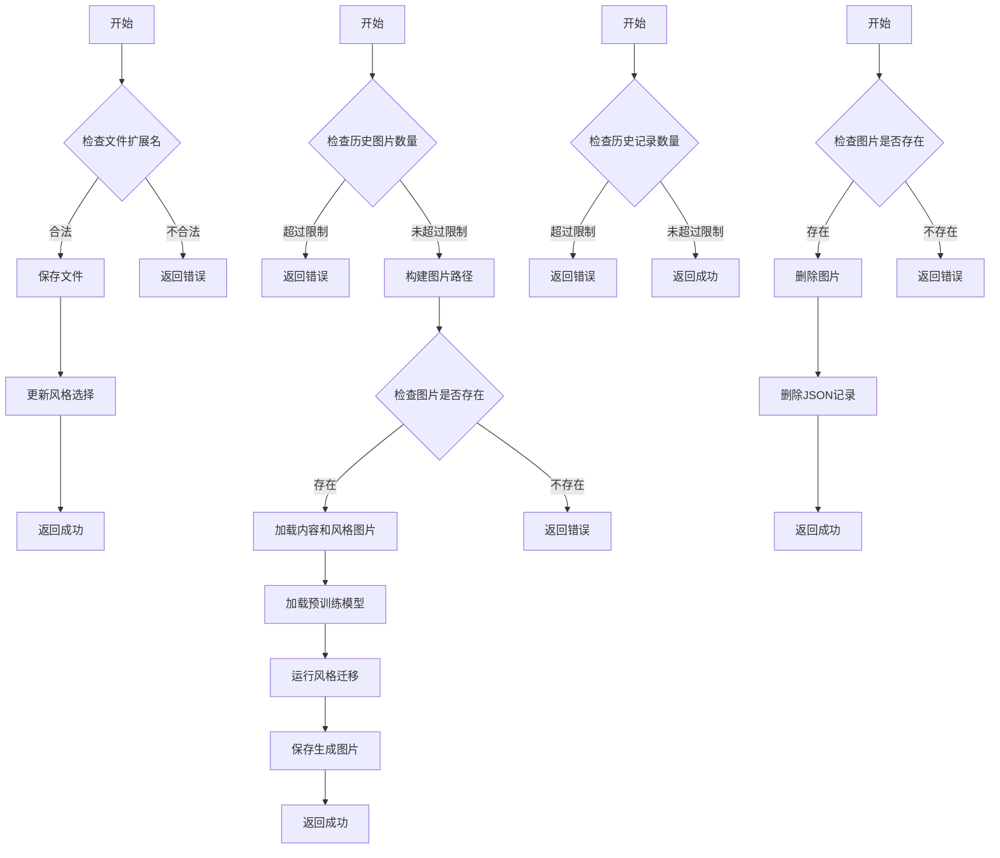

当然可以，以下是将数据流图集成到您的Markdown文件中的完整内容：

```markdown
# 图像风格迁移项目

本项目实现了基于PyTorch的图像风格迁移。

## 项目结构
- `images/`：包含样式图像和内容图像。
- `main.py`：主程序，用于执行图像风格迁移。
- `requirements.txt`：项目所需依赖。

## 安装依赖
运行以下命令安装项目依赖：
```bash
pip install -r requirements.txt
```

## 数据流图
以下是图像风格迁移流程的数据流图：

